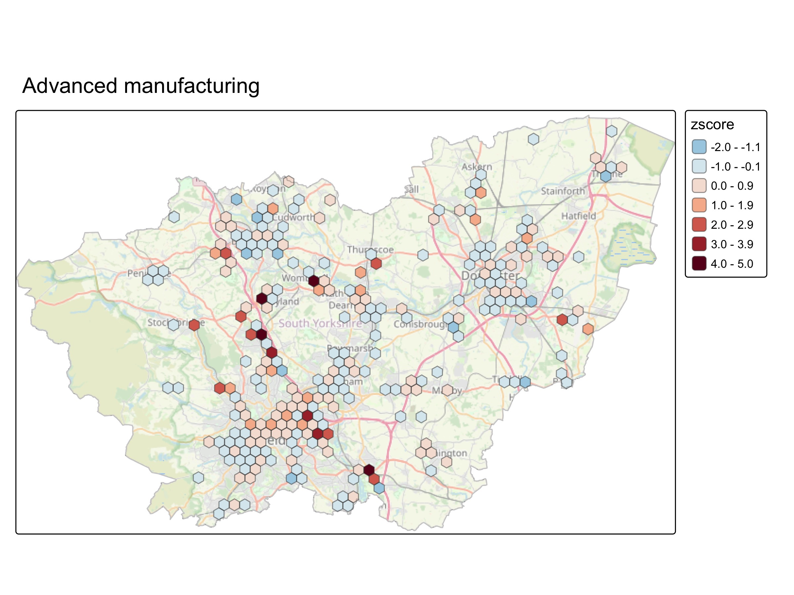
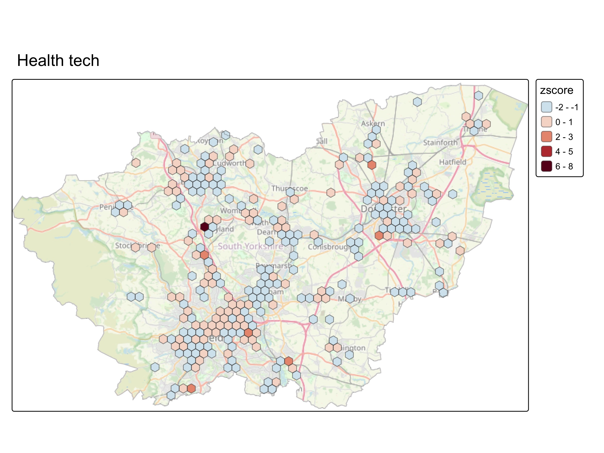
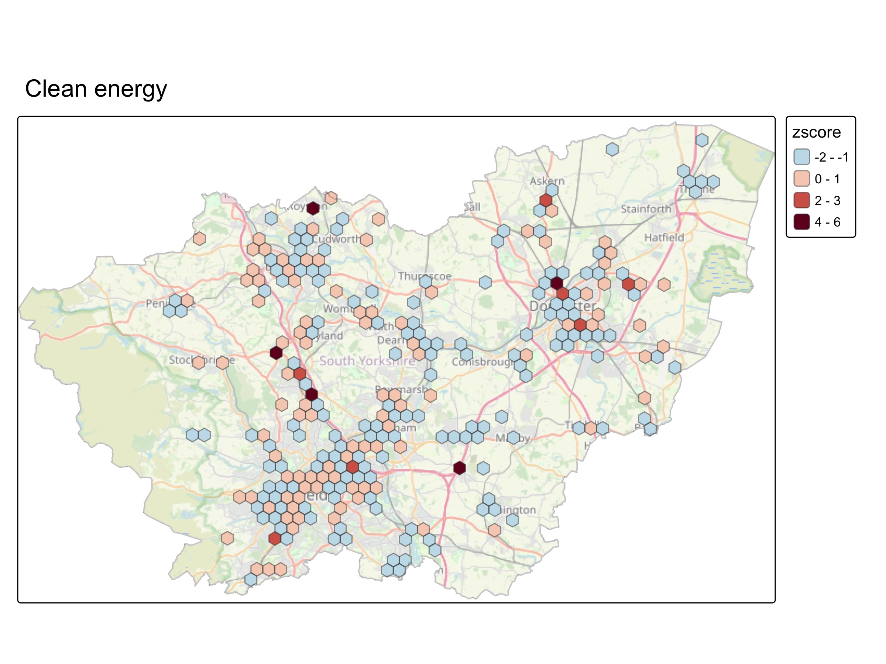
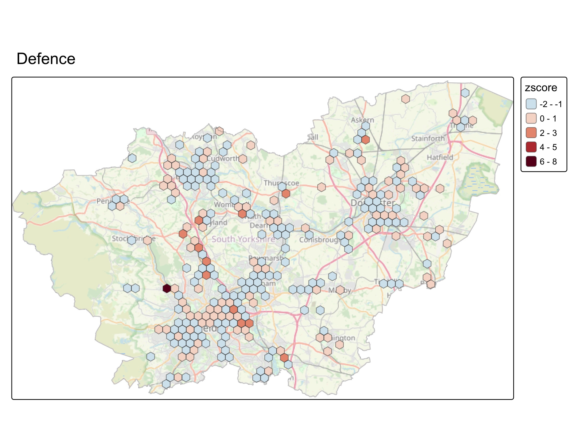
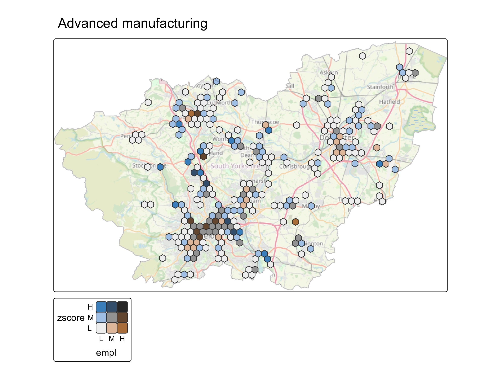
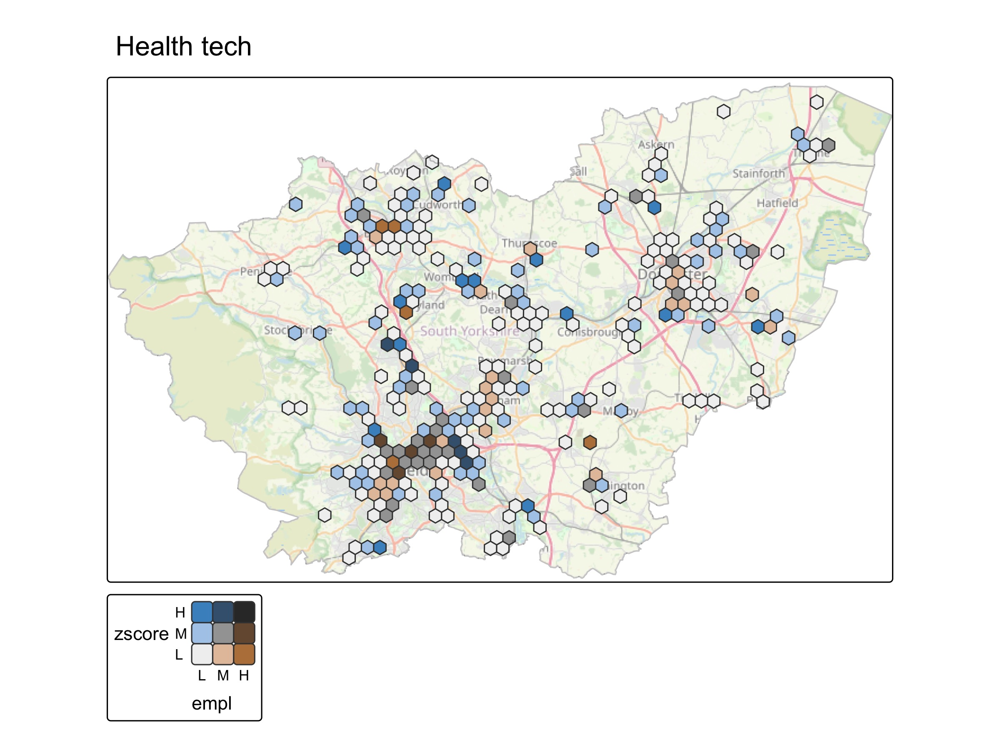
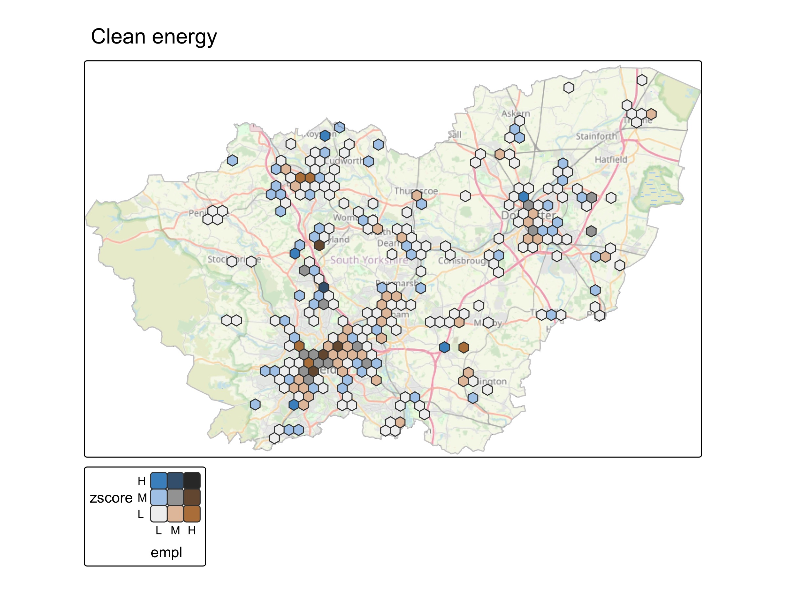
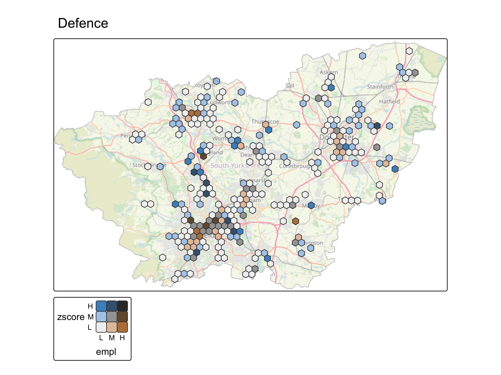

```{r setup}
library(tidyverse)
library(ggrepel)
library(sf)
library(tmap)
library(ggridges)
library(plotly)
source('../../adhoc_functions.R')

options(scipen = 999)

#Set ggplot theme
theme_set(theme_light())

firmtable = readRDS('../../local/sy_firmtable.rds')


```


## What's this?

* A series of South Yorkshire maps of **four bespoke sectors** based on machine learning from companies' own website text ([code](https://github.com/DanOlner/companieshouseopen)). They cover advanced manufacturing, health tech, clean energy and defence.
* Firms with 10+ employees were used. Of those 3661 businesses, 1565 (42.6%) had websites validated against the firm's postcode - these went into the learning algorithm. See the table below for the numbers on the source data extracted from Companies House accounts.
* Those 3661 firms with 10+ employees are only 11% of total firms, but have 65% of employees. So the firms going into this cluster data cover about 30% of employees in Companies House data for the last year.
* All maps use standardised z-scores for 'likelihood of belonging to this sector' for comparability. So e.g. a z-score of 1 or more puts a firm in the top 16% for that sector. 
* There are **two kinds of map here**.
    - (1) The z-score for each sector. Each hex shows the average z-score for that zone, weighted by employees per firm. 
    - (2) Bivariate maps of the same sectors showing the low/medium/high weighted z-score alongside where has relatively low, medium or high employee counts.
* Note, each map uses the same hex zones (1km across) - these are the places in South Yorkshire that have at least 25 employees per hex, for those 1565 businesses.
    
Combined those two can be useful - e.g. for clean energy, the z-score map shows two hexs north of Doncaster centre; the bivariate map for the same sector shows a zone with a high z-score, but relatively low employment    


```{r}
knitr::kable(firmtable, escape = FALSE, caption = "Table: Companies House firm stats, data for last year up to Dec 2025")


```


## Four sector maps

{width="900px"}
{width="900px"}
{width="900px"}
{width="900px"}

## Sector score vs employee count maps

{width="900px"}
{width="900px"}
{width="900px"}
{width="900px"}
